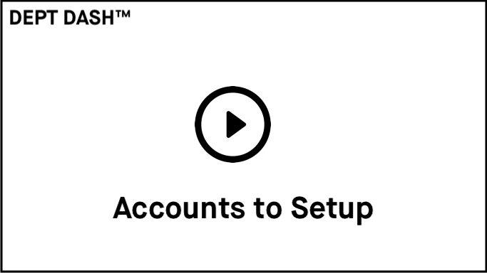

### GitHub and CI

Your DEPT DASH™ stack comes with a GitHub Actions workflow that handles automatically deploying your app to production and staging environments.

Prior to your first deployment, you'll need to do a few things:

- Create a new [GitHub Repository](https://repo.new), and then add it as the remote for your project. Do not push your app yet, as we'll add some secrets to the github repo.

```sh
git remote add origin <ORIGIN_URL>
```

### Set up GitHub secrets

Before you push your code to Github, verify that you're using the correct secrets for your app's configuration. Most common are:

- `AWS_ACCESS_KEY_ID`
- `AWS_SECRET_ACCESS_KEY`
- `CONTENTFUL_ENV_ID`
- `CONTENTFUL_HOST`
- `CONTENTFUL_MANAGEMENT_ACCESS_TOKEN`
- `CONTENTFUL_SPACE_ID`
- `FLY_API_TOKEN`
- `GA_TRACKING_ID`

DEPT DASH™ includes a `.env.example` file in the root of the project. You can copy that file to a
set`.envrc` and update the values. Then, you can run `scripts/update-github-secrets.sh` to copy those values to your GitHub secrets (you'll need to have the [GitHub CLI](https://cli.github.com/) installed).

### Make accounts with other third-party services

[](https://dept-dash-demo-videos.s3.amazonaws.com/Account+Setup.mp4)
